# orderERP

企业级 ERP/进销存练习项目（前后端分离）。当前已完成 **第一阶段（System Core）**、**第二阶段（Base Data）**、**第三阶段（WMS Core）**、**第四阶段（Purchase）**、**第五阶段（Sales）** 的核心能力，并配套了基于 **Testcontainers + MySQL** 的集成测试用例。

---

### 第一阶段（System Core）

- 登录 / 权限 / 动态菜单：`docs/screenshots/stage1-auth-and-menu.png`

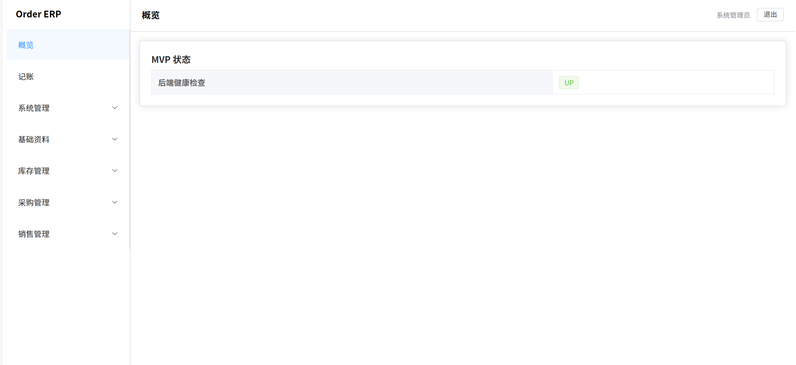

### 第二阶段（Base Data）

- 商品管理：`docs/screenshots/stage2-products.png`
- 往来单位管理：`docs/screenshots/stage2-partners.png`
- Excel 导入/导出：`docs/screenshots/stage2-excel.png`


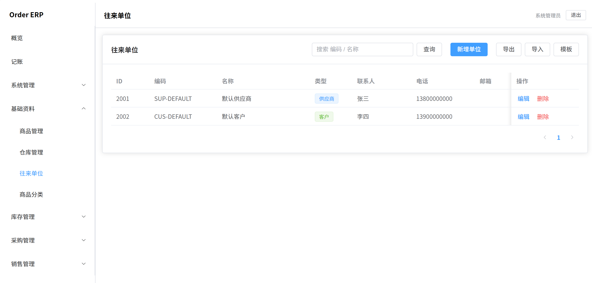


### 第三阶段（WMS Core）

- 库存列表：`docs/screenshots/stage3-stocks.png`
- 库存流水：`docs/screenshots/stage3-stock-logs.png`
- 盘点单（含自动调账）：`docs/screenshots/stage3-check-bills.png`

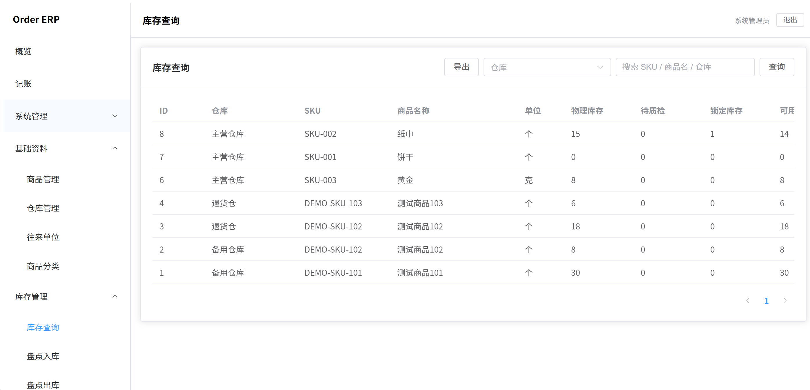
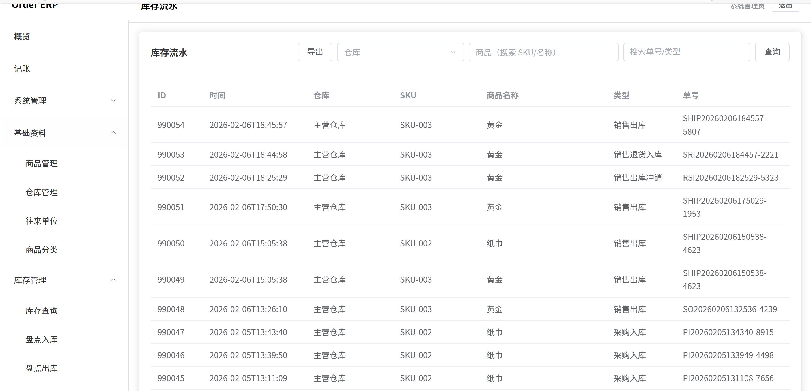
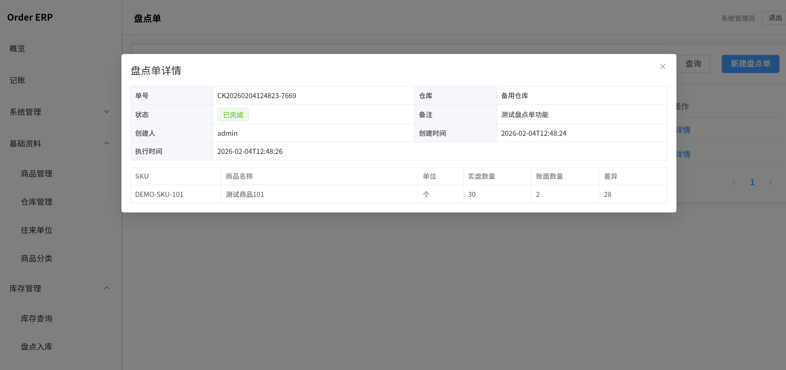

### 第四阶段（Purchase）

- 采购入库（分批收货/质检）：`docs/screenshots/stage4-purchase-inbounds.png`
- 采购退货：`docs/screenshots/stage4-purchase-returns.png`
- 采购对账单（AP）：`docs/screenshots/stage4-purchase-ap-bills.png`

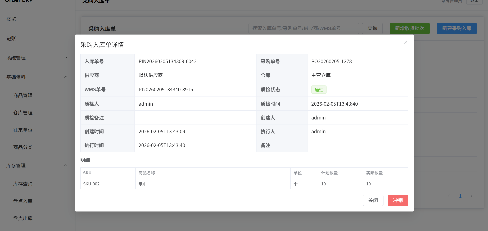
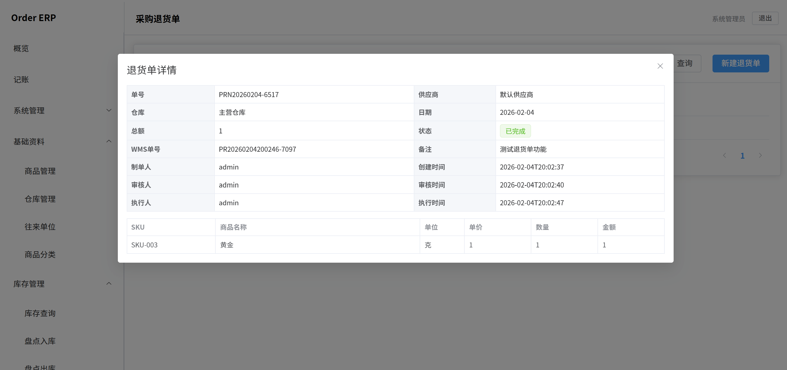
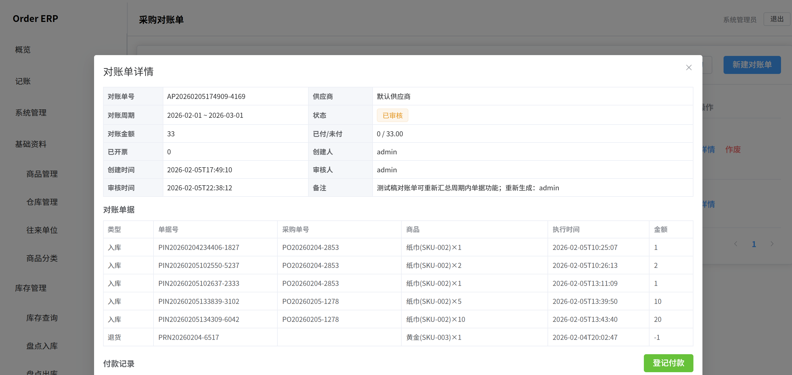

### 第五阶段（Sales）

- 销售出库（发货记录/分批）：`docs/screenshots/stage5-sales-outbounds.png`
- 发货冲销：`docs/screenshots/stage5-sales-ship-reverse.png`
- 销售退货：`docs/screenshots/stage5-sales-returns.png`
- 销售对账单（AR）：`docs/screenshots/stage5-sales-ar-bills.png`

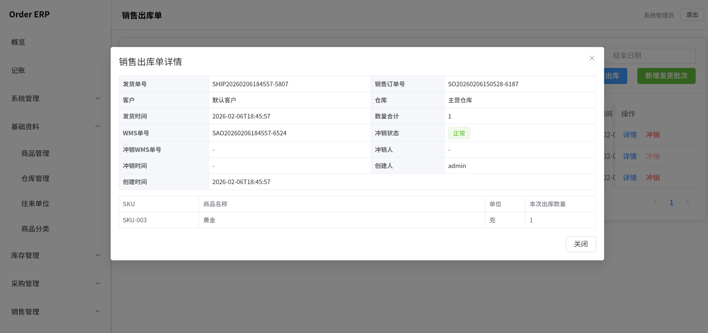
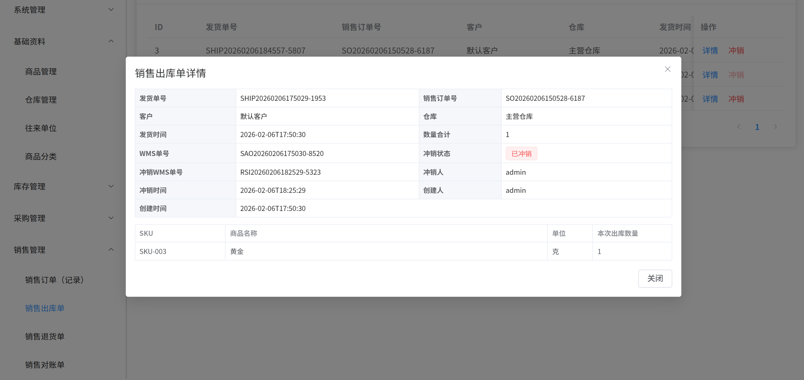
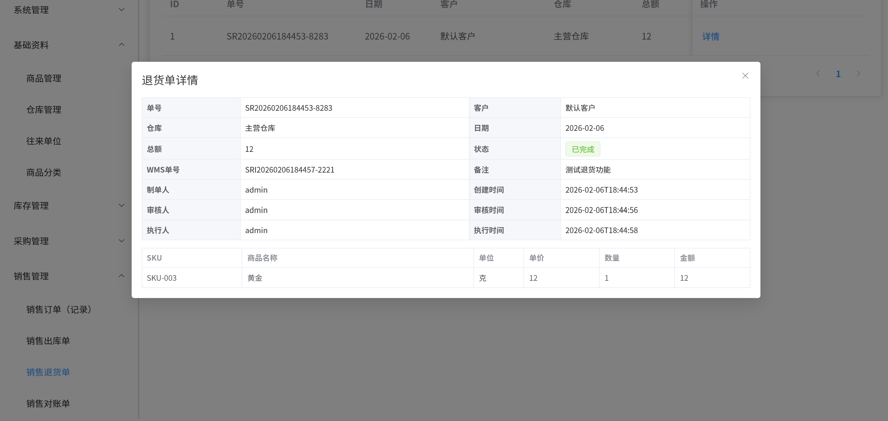
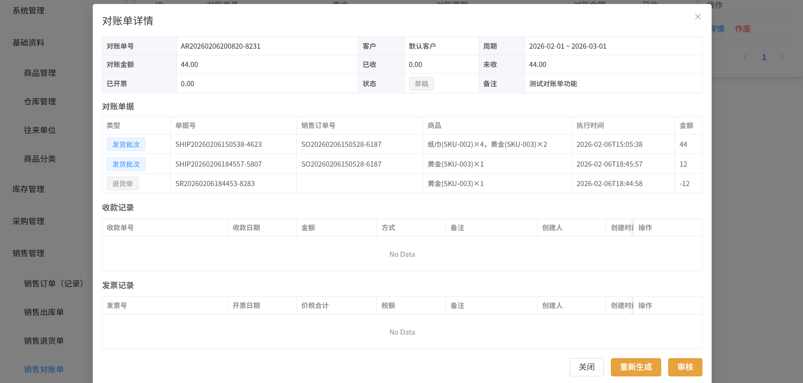

## 1. 项目结构

```
orderERP/
├── backend/                 # Spring Boot 后端（JPA + JWT + Flyway）
│   ├── src/main/java/...    # 业务代码（system/base/wms/ledger）
│   ├── src/main/resources/  # application.yml + Flyway 迁移脚本 db/migration
│   └── src/test/java/...    # Testcontainers 集成测试（阶段 1/2/3/4/5）
├── frontend/                # Vue3 前端（Vite + Pinia + Element Plus）
├── docs/screenshots/        # README 展示截图占位（你后续补图放这里）
├── uploads/                 # 本地上传目录（开发环境）
├── scripts/                 # 脚本（例如演示数据手动导入）
└── *.md                     # 阶段文档/问题复盘/工程化记录
```

---

## 2. 技术栈（以当前工程为准）

### 2.1 后端（backend）
- Java + Spring Boot 3.x
- Spring Security（JWT 无状态认证）
- JJWT（Token 生成/解析）
- Spring Data JPA（Repository/Entity）
- Flyway（数据库迁移与种子数据）
- EasyExcel（Excel 导入/导出）
- Springdoc OpenAPI（Swagger UI）
- Actuator（健康检查等）
- 数据库：MySQL 8.x（开发/测试），测试可用 Testcontainers 拉起临时 MySQL

### 2.2 前端（frontend）
- Vue 3 + Vite
- Pinia（状态/权限集合）
- Vue Router（动态路由）
- Element Plus（UI 组件）

---

## 3. 阶段进度与功能清单

### 3.1 第一阶段：System Core（系统地基）

目标：跑通 **登录/JWT**、**权限校验**、**菜单动态加载（千人千面）**。

已实现（关键点）：
- 认证：`POST /api/auth/login`
  - 通过 Spring Security `AuthenticationManager` 完成用户名密码认证
  - 生成 JWT 并返回给前端
- JWT 鉴权：`JwtAuthenticationFilter`
  - 读取 `Authorization: Bearer <token>`，解析 username，加载用户并注入 SecurityContext
- RBAC 权限模型（表结构与初始化）：`sys_user/sys_role/sys_menu/sys_user_role/sys_role_menu`
  - 迁移脚本：`backend/src/main/resources/db/migration/V1__init.sql`
  - 默认用户：`admin / 123456`（历史数据兼容：明文密码会自动按 `{noop}` 处理）
- 动态菜单路由：`GET /api/system/menu/routers`
  - 后端根据用户 id 返回可访问菜单树（用于前端动态路由构建）
- 个人信息与权限集合：
  - `GET /api/system/user/profile`
  - `PUT /api/system/user/profile`
  - `POST /api/system/user/profile/password`
  - `GET /api/system/user/perms`（前端按钮级权限控制基础）

对应测试：
- `backend/src/test/java/com/ordererp/backend/system/SystemStage1IT.java`

---

### 3.2 第二阶段：Base Data（基础资料）

目标：补齐 ERP 运行所需“静态基础资料”，并提供 Excel 导入导出能力。

已实现（关键点）：
- 商品（`base_product`）CRUD + options 下拉
  - `GET /api/base/products`
  - `GET /api/base/products/{id}`
  - `GET /api/base/products/options`
  - `POST /api/base/products`
  - `PUT /api/base/products/{id}`
  - `DELETE /api/base/products/{id}`
  - 唯一键策略：`product_code` 唯一；逻辑删除后再次创建同编码时“复活”旧记录（避免唯一约束冲突）
- 仓库（`base_warehouse`）CRUD + options 下拉
- 往来单位（`base_partner`）CRUD + options 下拉
- Excel 能力（EasyExcel）：
  - 导出：`GET /api/base/*/export`
  - 模板：`GET /api/base/*/import-template`
  - 导入：`POST /api/base/*/import`（multipart file）
  - 下载体验：响应头与文件名编码通过 `ExcelHttpUtil` 统一处理

对应测试：
- `backend/src/test/java/com/ordererp/backend/base/BaseStage2IT.java`

---

### 3.3 第三阶段：WMS Core（库存核心）

目标：建立可追溯的库存账本，通过 WMS 单据变更库存（先不依赖订单）。

核心数据模型：
- `wms_stock`：实时库存（`stock_qty/locked_qty/version`，可用库存 = `stock_qty - locked_qty`）
- `wms_io_bill` + `wms_io_bill_detail`：盘点入库/出库单据（type=3/4）
- `wms_stock_log`：库存流水/审计日志（变更类型、业务单号、变更后库存）

已实现（关键点）：
- 库存查询：
  - `GET /api/wms/stocks`（返回 `stockQty/lockedQty/availableQty`）
  - 导出：`GET /api/wms/stocks/export`（已做分页分批写入，避免一次性加载）
- 盘点入库（type=3）：
  - 列表/详情/执行前校验/创建/执行/冲销
  - 执行/冲销在事务中完成：库存变更 + 明细 real_qty + 写入流水
- 盘点出库（type=4）：
  - 列表/详情/执行前校验/创建/执行/冲销
- 库存流水：
  - `GET /api/wms/stock-logs`（支持 keyword/warehouseId/productId + startTime/endTime）
  - 导出：`GET /api/wms/stock-logs/export`（分页分批写入）
- 工程化增强（对应文档第 6 章落地）：
  - 幂等与并发防护：
    - 反复执行：`execute` 已完成时直接返回“已完成结果”
    - 反复冲销：优先返回已存在的冲销单
    - DB 唯一约束：`wms_io_bill(biz_id, type)` 防止并发重复冲销（迁移 `V12__wms_unique_reversal.sql`）
    - 单据行锁：执行/冲销入口对单据主表使用 `PESSIMISTIC_WRITE`（串行化同单据写入）
  - 数据一致性：库存不变量校验（`stock_qty>=0`、`locked_qty>=0`、`locked_qty<=stock_qty`）
  - 盘点模型升级（实盘数量 counted_qty）：
    - 新增 `wms_check_bill / wms_check_bill_detail`
    - 执行盘点单时自动生成调整单（type=3/4）并写 `CHECK_ADJUST_IN/OUT` 流水
    - 迁移 `V13__wms_check_bill.sql`，接口 `/api/wms/check-bills`
  - 演示数据隔离：提供手动脚本 `scripts/seed-demo.sql`（不强绑生产迁移）

对应测试：
- `backend/src/test/java/com/ordererp/backend/wms/WmsStage3HardeningIT.java`

---

### 3.4 第四阶段：采购业务（Purchase）

目标：把采购“业务流 + 库存联动 + 对账(AP)”跑通，贴近企业真实场景（分批收货、质检、退货、冲销/红冲、对账锁定）。

已实现（主要功能）：
- 采购订单：录入采购明细（含单价/数量/金额快照）、审核、作废
- 采购入库：按采购单收货生成入库单、支持分批收货；质检通过后生成 WMS 入库并增加库存；支持不合格处理；支持入库冲销/红冲（修正错误入库）
- 采购退货：审核/执行，执行后生成 WMS 出库并扣减库存
- 采购对账单（AP）：按供应商 + 周期汇总入库/退货，单据锁定防重复对账；审核锁定后禁止再新增单据；支持草稿重新生成；支持付款登记/发票登记/作废

对应测试：
- `backend/src/test/java/com/ordererp/backend/purchase/PurchaseStage4IT.java`
- `backend/src/test/java/com/ordererp/backend/purchase/PurchaseStage4PartialInboundIT.java`
- `backend/src/test/java/com/ordererp/backend/purchase/PurchaseStage4ReturnIT.java`

---

### 3.5 第五阶段：销售业务（Sales）

目标：跑通“销售下单 -> 审核锁库 -> 发货扣库”，并补齐退货、发货冲销、应收对账(AR)闭环。

已实现（主要功能）：
- 销售订单：录入销售明细（含单价/数量/金额快照）、审核锁库、作废（释放未发部分锁库）
- 销售出库（发货记录）：支持分批/部分发货；发货生成 WMS 销售出库并扣减库存与释放锁库
- 发货冲销：用于修正“错误发货/错误扣库”，冲销会回滚库存并生成冲销 WMS 单据（幂等）
- 销售退货：审核/执行，执行后生成 WMS 入库并增加库存
- 销售对账单（AR）：按客户 + 周期汇总发货(+)与退货(-)，单据锁定防重复对账；审核后支持收款登记/发票登记；支持草稿重新生成/作废（未发生收款/开票前）

对应测试：
- `backend/src/test/java/com/ordererp/backend/sales/SalesStage5ReturnIT.java`
- `backend/src/test/java/com/ordererp/backend/sales/SalesStage5ArBillIT.java`

---

## 4. 快速开始

### 4.1 准备环境
- JDK：建议 17+（后端 pom 以 17 为基准）
- Maven 3.x
- Node.js（前端开发）
- MySQL 8.x（本地开发），或使用 Docker + Testcontainers（仅测试需要）

### 4.2 启动后端
```
cd backend
mvn spring-boot:run
```

### 4.3 启动前端
```
cd frontend
npm install
npm run dev
```

### 4.4 默认登录账号
- `admin / 123456`

---

## 5. 数据库与 Flyway

- Flyway 默认启用，迁移脚本位置：`backend/src/main/resources/db/migration/`
- 后端启动会自动 migrate（包含初始化数据/菜单/权限点）
- `DatabaseGuardConfig` 会校验“当前连接的 schema 名称”，避免误连错误库（例如把表建到其他 schema）。

如需修改数据库连接，编辑：
- `backend/src/main/resources/application.yml`

---

## 6. 运行测试（阶段 1/2/3/4/5）

前置条件：
- Docker Desktop 正常运行
- 网络能拉取镜像（至少 `mysql:8.0.36`、`testcontainers/ryuk`）

命令：
```
cd backend

# 第一阶段
mvn test "-Dtest=SystemStage1IT"

# 第二阶段
mvn test "-Dtest=BaseStage2IT"

# 第三阶段
mvn test "-Dtest=WmsStage3HardeningIT"

# 第四阶段
mvn test "-Dtest=PurchaseStage4IT"
mvn test "-Dtest=PurchaseStage4PartialInboundIT"
mvn test "-Dtest=PurchaseStage4ReturnIT"

# 第五阶段
mvn test "-Dtest=SalesStage5ReturnIT"
mvn test "-Dtest=SalesStage5ArBillIT"

# 全部测试
mvn test
```

---
